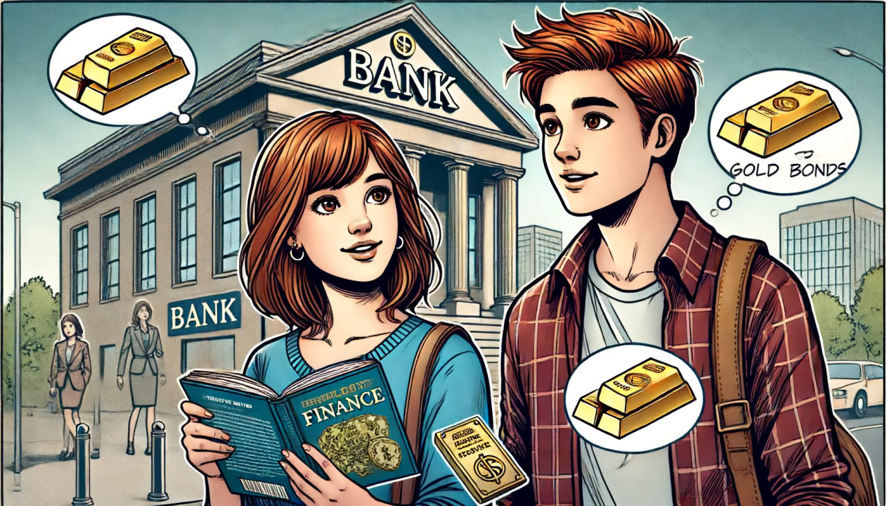
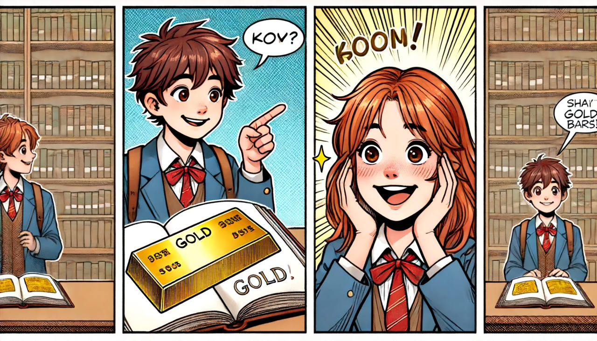
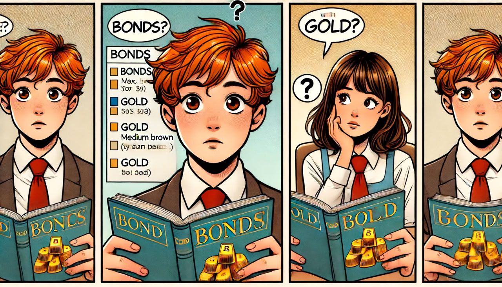
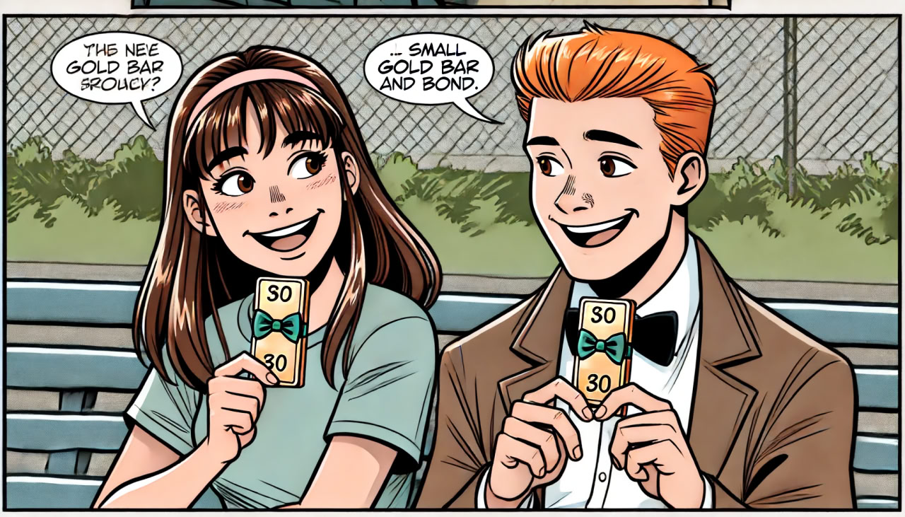

Создание последовательных персонажей в моделях генерации text-to-image на данный момент представляет собой значительную сложность. Основной проблемой является то, что даже при использовании одного и того же описания персонажей модели часто генерируют изображения с различными деталями. Это связано с тем, что генеративные модели, такие как DALL-E или Midjourney, каждый раз интерпретируют текстовые описания немного по-разному, что приводит к несоответствиям в таких элементах, как форма тела, цвет одежды, выражения лица и прочее. В результате сложно добиться стабильности и узнаваемости персонажей на различных изображениях, что особенно важно для создания комиксов или последовательных визуальных историй.

Для выполнение данных задач требуется дальнейшее обучение.

1. [stabilityai/stable-diffusion-3-medium-diffusers](https://github.com/stabilityai/stable-diffusion)
2. [alvdansen/littletinies](https://huggingface.co/alvdansen/littletinies)
3. ChatGPT4 (DALL-E) от OpenAI (интеграция через API)
4. [dashtoon](https://www.dashtoon.com/)

stabilityai/stable-diffusion-3-medium-diffusers, alvdansen/littletinies, к сожалению, не смогли создать последовательных персонажей в едином комиксе. 
У DALL-E и dashtoon следующие результаты

DALL-E

dashtoon

